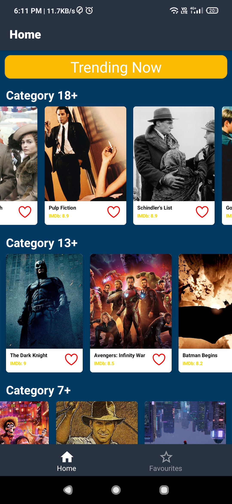
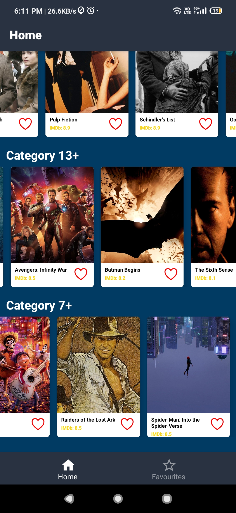
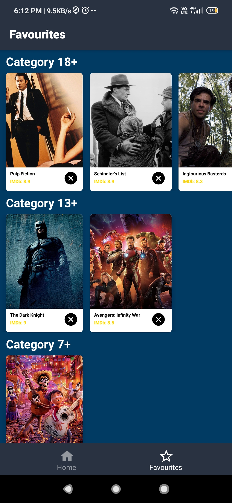
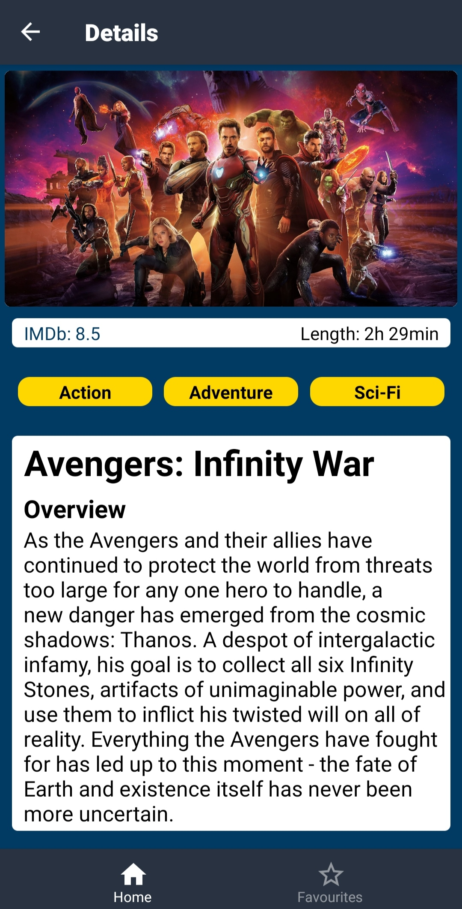

# Movies App | React Native

  
   

  
   
  

## Description
- This is a movies app devloped using React Native. Users can browse the movies which are divided into different categories according to their classification, i.e 18+, 13+ etc.
- Users can navigate to the movie details by clicking the movie card, and can also add or remove them from their favourites.
- User can also switch to the favourites page using the bottom tab navigation.
- For fetching the data from the movie API (https://wookie.codesubmit.io/movies), axios is used.
- For state management redux is used.

## Insatll Dependencies

    $ npm install

## Run android app

    $ expo start --android

